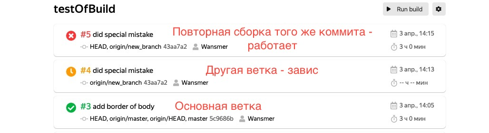

# Задание: React II

## Запуск приложения: 

1. Клонировать репозиторий из ветки `client-branch`;
2. Открыть два окна terminal: 
  - В одном окне перейти в директорию `./client`, запустить последовательно `npm i`, `npm run start`;
  - В другом окне перейти в директорию `./server` и проследовать [инструкции](../server/README.md); 

3. На порту 3000 откроется приложение;
4. Работу можно протестить [на этом репозитории](https://github.com/Wansmer/testOfBuild):
  - Reponame: testOfBuild;
  - Build command: npm run build. 

## Проблемы

1. Раскраска логов: ansi to html подключено, но не понимаю, как сохранить лог с управляющими символами из stdout и stderr при сборке. Буду благодарен за помощь в решении данного вопроса;
> код получения лога [здесь](../server/app/process.js) в функции `startBuild`.
2. При запуске rebuild на странице Details обновляется URL для показа новой сборки, но отображение происходит только при обновлении страницы; 
3. При добавлении коммита не из текущей ветки сборка зависает, но срабатывает со второго запроса - не могу найти ошибку: 
